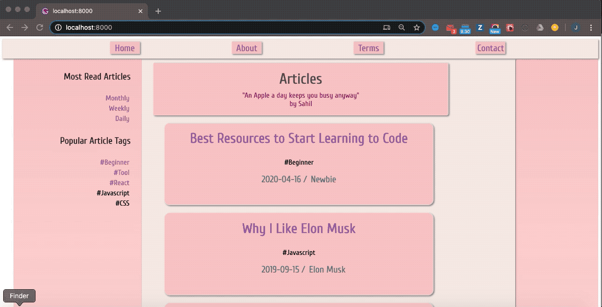

Chingu Voyage 18 Team Project - [Chingu.io](https://chingu.io)

# Toucans 05 Team - Blog App

For Chingu Voyage 18 the Toucans team 05 created a blog application based on
[Dev.to](https://dev.to). This was created over 6-weeks following the 
Agile Scrum methodology.

Some of the features of this app are:

- Provide users with a quick and easy way to locate articles and display their
content
- Find the most popular articles through hashtags (`#`)
- Find the most read articles by day, week, and month
- Display a motivational quote at the top of the page

The app is deployed [here](https://v18toucans05.netlify.app/).

## Getting Started

This project is based on several packages including [Gatsby/React](https://gatsbyjs.org), [Sass](https://sass-lang.com/), and 
[GraphQL](https://graphql.org/).

### Running Locally

1. Fork or clone the project from this repo
2. `npm install` to download and install packages from `package.json`
3. `npm run develop` to run the app
4. Once the app has started open the browser using the URL `localhost:8000` to
use the app

**_That's all!_**

### Deploying the App

We have chosen to deploy to [Netlify.com](https://netlify.com). However, you 
may prefer another hosting service. When choosing a site to deploy to make 
sure it supports Gatsby and React.

### Prerequisites

All dependencies are included in the `package.json` file.

The following environment variables are required to run the app. These should
be added to a `.env.development` file in your local repo for testing and to 
the hosting service for your Production deployment.

| Variable Name       | Description |
|---------------------|-------------|
| API_KEY             | Private key for the [quote](https://quotes21.p.rapidapi.com/quote) |
| GATSBY_ALGOLIA_APP_ID | Application ID for the [Algolia search engine](https://www.gatsbyjs.org/packages/gatsby-plugin-algolia/?=algo) |
| GATSBY_ALGOLIA_SEARCH_KEY | Private key for the Algolia search service |
| ALGOLIA_ADMIN_KEY | Administrative private key for the Algolia search service |

You can find more information about how to use Algolia in Gatsby [here](https://janosh.io/blog/gatsby-algolia-search)

## Authors

* **[Angel Young](https://github.com/angelyoung24)** 
* **[yourname](your github URL)**
* **[yourname](your github URL)**

## License

This project is licensed under the [MIT License](https://opensource.org/licenses/MIT)
