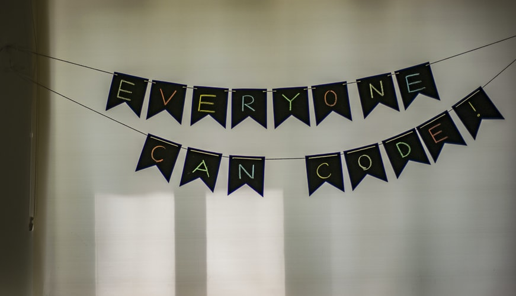

---
title: "Best Resources to Start Learning to Code"
date: "2020-04-16"
author: "Newbie"
category: "Beginner"
popularity: "Monthly"
---

Everyone Can Code ! -Photo by Adi Goldstein

 Like many others, maybe you're looking to learn more about programming! Well, look no more! Today, I will list my <strong> top three </strong> resources that can help you begin your programming journey today!

 Let's get started! 

<ol>
<li> Congrats! You found it! It's here at <strong> <a href="https://dev.to/"> dev.to</a></strong>! </li>

This is one of the best resources for learning to code and luckily you have already stumbled across it. So, good work! There's a <em> huge </em> community of people here at dev.to who you can ask anything about tech to and many more ways to network with those in the industry. 
 </li>
<li> <strong><a href="https://freecodecamp.com">Free Code Camp</a></strong> 
 This is another <em> excellent</em> resource for learning to code! Free Code Camp teaches you new languages and allows you to work with them right on the same page! It's a great way to tinker while you learn instead of getting bogged up in tutorial only resources. Active Learning beats Passive Learning everytime! 
</li>
<li> <strong><a href="https://chingu.io">Chingu.io</a></strong>
The final resource for learning to code, is also the most challenging but also most rewarding. Chingu.io takes all of the soft skills you've learned from networking with people on Dev.to along with the technical skills you've acquired in Free Code Camp by putting you in a remote team. It's the perfect way to put all of your skills to the test while allowing you to familiarize yourself with the experience necessary to land your first developer job! </li>
</ol>

 Hope these resources help you all start your coding journey right! 

<h3> Happy coding guys! </h3>

